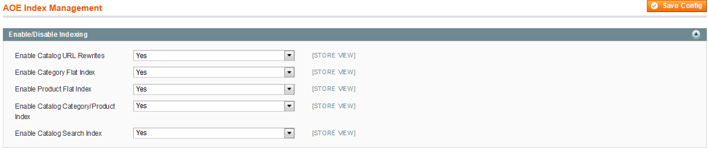

# Aoe_StoreIndex

This module allows to disable the index on store level from `System -> Configuration -> ADVANCED -> AOE Index Management`.

## License
[OSL v3.0](http://opensource.org/licenses/OSL-3.0)

## Contributors
* [Manish Jain] (AOE)
